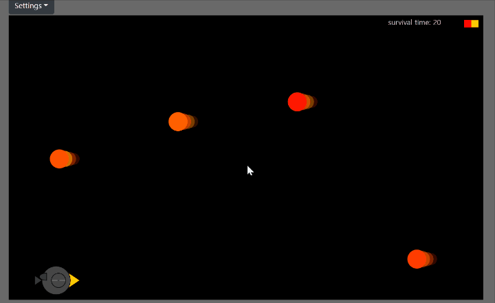

# Dodge Game
It is a simple game to dodge the bird to make the bird avoid the fire balls flying toward it. <br  />



original code: [https://www.openprocessing.org/sketch/641172](https://www.openprocessing.org/sketch/641172)<br  />

### Game screens
* There are 4 screens in the game: game start screen, how to play screen, game play screen, game over screen.
* Use variable ```start``` to indicate which screen to show; <br  />
```start = -1```: game start <br  />
```start = -2```: how to play <br  />
```start = 1```: game play <br  />
```start = 0```: game over <br  />
    
### Bird
* A bird is drawn by ```function bird()```.
* The eyelids and wings' speed changes depending on the value of ```y``` (y-coordinate of birds' position) <br  />
* The bird is moved upwards by pressing the [space bar] and droped downwards when nothing is done. (line 79-83) 
```        y = constrain(y, -H, 0); // set the range for positioning the bird <br  />
        if (keyIsDown(32)) { // keycode for space bar is 32, when pressed, birds' altitude increases.
            y -= 6;
        }
        y += 2; // when nothing is done, the altitude is lowered automatically.
```
* The range that bird can move around is from ground to just above the screen of vertical direction. (```y = constrain(y, -H, 0);```, line 79) <br  />
* The speed that bird can move is constant.

### Fire balls
* Fire balls are made with ```class fireball```.
* New fire balls are made with regular spaces, and added to the list ```balls``` which saves all the fire balls displayed on the screen.
* Each fire balls has x and y coordinates, which values are saved in lists ```xcoor``` and ```ycoor```. <br  />
  y-coordinate is set randomly: ```let y2 = random(20, H - 30)```, line 64 <br  /> 
  x-coordinate is initially set as 0 and then increased depending on time passed: ```xcoor[n] += 2 + (time2 - time1) / 20;```, line 58 <br  />
  So the speed of fire balls increases as time passes.
* When the x-coordinate becomes big enough that the fire ball goes over the screen, it will be eliminated from the ```balls``` list.
  (x and y coordinates also gets eliminated from ```xcoor``` and ```ycoor```)
* The color range of fire balls can be changed with html input. <br  />
  The color values are set in the js page and is shown on upper rightside of the screen.

### Game over
* Use the coordinates of the bird and fire balls saved in lists.
* If the distance between two coordinates is close enough, the ```start``` value changes to 0 and game overs.

### Time (Record)
* The time of game play is measured by setting <br  />
  ```time1 = millis() / 1000;``` at the start of the game play <br  />
  ```time2 = millis() / 1000;``` at end of game and substitute time1 from time2. <br  />
* It is shown on the upper right side of screen during the game play and displayed as a record on game over screen. 
